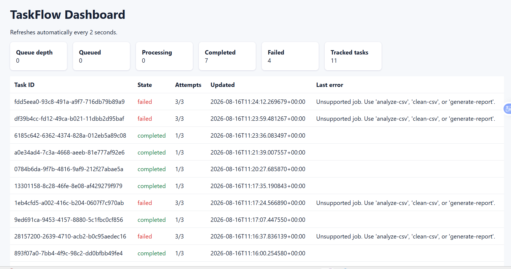
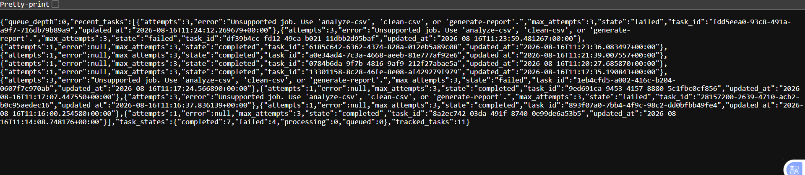

```md
# TaskFlow

TaskFlow is a distributed CSV-processing system. It accepts CSV tasks through an API, places them in a Redis queue, and lets independent workers process them in the background.

It is designed to show how real applications handle long-running work—such as analysing sales data, cleaning uploaded files, or generating reports—without making the user wait for the API.

## Problem

A normal API can become slow or fail when it tries to do heavy work during the user request.

For example, if a user uploads a large sales CSV and the API immediately tries to analyse it, the user may wait a long time and the request may time out.

TaskFlow separates task submission from task processing.

User uploads CSV
      ↓
API accepts the task quickly
      ↓
Redis stores the task in a queue
      ↓
Worker picks up the task
      ↓
Worker processes the CSV
      ↓
User downloads the result
```

## Features

- Upload real CSV files
- Analyse CSV data
- Detect missing values
- Calculate numeric summaries
- Clean CSV files
- Generate Markdown reports
- Download generated output files
- Redis-based task queue
- Multiple worker containers
- Automatic retry for failed jobs
- Monitoring dashboard
- Docker Compose local setup
- Kubernetes and Terraform starter configuration

## Supported Jobs

| Job type | What it does | Downloaded file |
|---|---|---|
| `analyze-csv` | Finds missing values and numeric statistics | `csv-analysis.json` |
| `clean-csv` | Removes blank rows and trims whitespace | `cleaned-data.csv` |
| `generate-report` | Creates a readable Markdown summary | `taskflow-report.md` |

## Technology Stack

- Python
- Flask
- Redis
- Docker
- Docker Compose
- Kubernetes
- Terraform
- AWS S3 and IAM configuration

## Project Structure

```text
taskflow/
├── api/
│   ├── app.py
│   ├── Dockerfile
│   └── requirements.txt
├── worker/
│   ├── worker.py
│   ├── Dockerfile
│   └── requirements.txt
├── k8s/
│   ├── api.yaml
│   ├── worker.yaml
│   ├── redis.yaml
│   └── configmap.yaml
├── terraform/
│   ├── main.tf
│   ├── variables.tf
│   └── outputs.tf
├── docker-compose.yml
└── README.md
```

## Run Locally

### Requirements

- Docker Desktop
- VS Code recommended

### Start the application

Open a terminal inside the `taskflow` folder:

```powershell
docker compose up --build -d
```

This starts:

- Redis
- Flask API
- Two worker containers

Check whether all containers are running:

```powershell
docker compose ps
```

## Check API Health

```powershell
Invoke-RestMethod http://localhost:8080/healthz
```

Expected result:

```text
status
------
ok
```

## Upload a Real CSV File

Place a CSV file, for example `titanic.csv`, inside the project folder.

### Analyse CSV Data

```powershell
curl.exe -X POST http://localhost:8080/tasks/upload -F "job=analyze-csv" -F "file=@.\titanic.csv"
```

### Clean CSV Data

```powershell
curl.exe -X POST http://localhost:8080/tasks/upload -F "job=clean-csv" -F "file=@.\titanic.csv"
```

### Generate a Report

```powershell
curl.exe -X POST http://localhost:8080/tasks/upload -F "job=generate-report" -F "file=@.\titanic.csv"
```

Each command returns a `task_id`.

## Check Task Status

Copy the returned `task_id` and run:

```powershell
Invoke-RestMethod http://localhost:8080/tasks/PASTE-TASK-ID-HERE
```

A successful task moves through these states:

```text
queued → processing → completed
```

## Download Generated Output

After the task is complete, download its output file:

```powershell
curl.exe -OJ http://localhost:8080/tasks/PASTE-TASK-ID-HERE/download
```

Downloaded files depend on the selected job:

```text
analyze-csv      → csv-analysis.json
clean-csv        → cleaned-data.csv
generate-report  → taskflow-report.md
```

## CSV Analysis Example

For this CSV:

```csv
name,sales
Asha,1200
Ravi,900
Mina,
```

TaskFlow finds:

- 3 rows
- 2 columns: `name` and `sales`
- 1 missing `sales` value
- Total sales: `2100`
- Average sales: `1050`

## Automatic Retry

TaskFlow retries failed tasks up to three times.

To test retries, submit an intentionally invalid job:

```powershell
$task = Invoke-RestMethod -Uri "http://localhost:8080/tasks" -Method Post -ContentType "application/json" -Body '{"job":"not-real","csv":"name,sales\nAsha,1200"}'
$task
```

Then check the task:

```powershell
Invoke-RestMethod http://localhost:8080/tasks/PASTE-TASK-ID-HERE
```

Expected result:

```text
attempts     : 3
max_attempts : 3
state        : failed
error        : Unsupported job
```

This proves that TaskFlow retries a failed task before marking it as permanently failed.

## Monitoring Dashboard

Open this address in Chrome or Edge:

```text
http://localhost:8080/dashboard
```

Do not type the URL directly as a PowerShell command.

The dashboard shows:

- Queue depth
- Queued tasks
- Processing tasks
- Completed tasks
- Failed tasks
- Retry attempts
- Recent task errors



Metrics are also available at:

```text
http://localhost:8080/metrics
```


## Testing Evidence

Tested locally with Docker Compose.

- [x] Redis started successfully
- [x] Flask API started successfully
- [x] Two worker containers started successfully
- [x] API health check returned `ok`
- [x] CSV analysis completed successfully
- [x] CSV cleaning completed successfully
- [x] Markdown report generation completed successfully
- [x] Real CSV dataset with missing values was used
- [x] Downloadable output files were generated
- [x] Automatic retry was tested
- [x] Invalid task failed after three retry attempts
- [x] Monitoring dashboard was added

````markdown
## Performance & Scalability

TaskFlow was load-tested by submitting **100 `analyze-csv` tasks** through the Dockerized API, Redis queue, and worker services.

### Load Test Setup

#### 1. Start with 1 Worker

```bash
docker compose up --scale worker=1 -d
````

Verify the running services:

```bash
docker compose ps
```

Expected services:

```text
taskflow-api-1       Up (healthy)
taskflow-redis-1     Up (healthy)
taskflow-worker-1    Up
```

#### 2. Run the Load Test

```bash
python .\Loadtest_real.py
```

Output:

```text
Submitting 100 analyze-csv tasks...
All 100 tasks submitted in 0.47s

--- RESULTS ---
Total tasks: 100
Completed: 100
Failed: 0
Timed out: 0
Total wall time: 1.72s
Throughput: 58.14 tasks/sec
Avg time-to-completion: 0.12s
p95 time-to-completion: 0.27s
```

### 3. Scale to 5 Workers

```bash
docker compose up --scale worker=5 -d
```

Verify all worker instances:

```bash
docker compose ps
```

The system successfully started:

```text
taskflow-api-1
taskflow-redis-1
taskflow-worker-1
taskflow-worker-2
taskflow-worker-3
taskflow-worker-4
taskflow-worker-5
```

### 4. Run the Same Load Test with 5 Workers

```bash
python .\Loadtest_real.py
```

Output:

```text
Submitting 100 analyze-csv tasks...
All 100 tasks submitted in 0.52s

--- RESULTS ---
Total tasks: 100
Completed: 100
Failed: 0
Timed out: 0
Total wall time: 0.82s
Throughput: 121.93 tasks/sec
Avg time-to-completion: 0.03s
p95 time-to-completion: 0.04s
```

### Performance Comparison

| Metric                  |        1 Worker |        5 Workers |      Improvement |
| ----------------------- | --------------: | ---------------: | ---------------: |
| Total Tasks             |             100 |              100 |                — |
| Completed               |             100 |              100 |                — |
| Failed                  |               0 |                0 |                — |
| Timed Out               |               0 |                0 |                — |
| Total Wall Time         |           1.72s |            0.82s | **52.3% faster** |
| Throughput              | 58.14 tasks/sec | 121.93 tasks/sec |         **2.1×** |
| Avg. Time-to-Completion |           0.12s |            0.03s |    **75% lower** |
| p95 Time-to-Completion  |           0.27s |            0.04s |    **85% lower** |

### Key Results

* **52.3% reduction in total processing time** — 1.72s → 0.82s
* **2.1× throughput improvement** — 58.14 → 121.93 tasks/sec
* **75% reduction in average task completion time** — 0.12s → 0.03s
* **85% reduction in p95 completion time** — 0.27s → 0.04s
* **100% task completion** with 0 failures and 0 timeouts
* Successfully scaled the worker pool from **1 → 5 Docker containers**

### Scaling Insight

The workload is computationally lightweight, so scaling from 1 to 5 workers does not produce a linear 5× speedup.

The observed **2.1× throughput improvement** demonstrates that additional workers improve parallel task processing, while the overall speedup is bounded by the relatively small execution time of each individual task.

This provides a realistic scalability result rather than an artificially inflated benchmark.

````

The results and commands are based directly on actual load-test runs: 1 worker produced **1.72s / 58.14 tasks/sec**, while 5 workers produced **0.82s / 121.93 tasks/sec**, with 100/100 tasks completed in both runs. :contentReference[oaicite:0]{index=0}

For the 5-worker run, Docker output confirms workers 1–5 were running before the second benchmark. :contentReference[oaicite:1]{index=1}
````
## Real-World Use Cases

TaskFlow can be adapted for:

- Sales-data analysis
- Student-mark processing
- Employee attendance reports
- Inventory-file cleaning
- Survey-data analysis
- Report generation
- Batch file processing

## Future Improvements

- Generate PDF reports
- Add user authentication
- Store task history in a database
- Use persistent Redis storage
- Add Prometheus and Grafana monitoring
- Deploy to AWS using EKS, S3, and Terraform
- Add email notification when a task is completed

## Learning Outcomes

This project demonstrates:

- REST API development with Flask
- Docker and Docker Compose
- Redis task queues
- Asynchronous background workers
- Distributed-system design
- CSV processing
- Error handling and retries
- Monitoring and observability
- Kubernetes and Terraform basics
```
